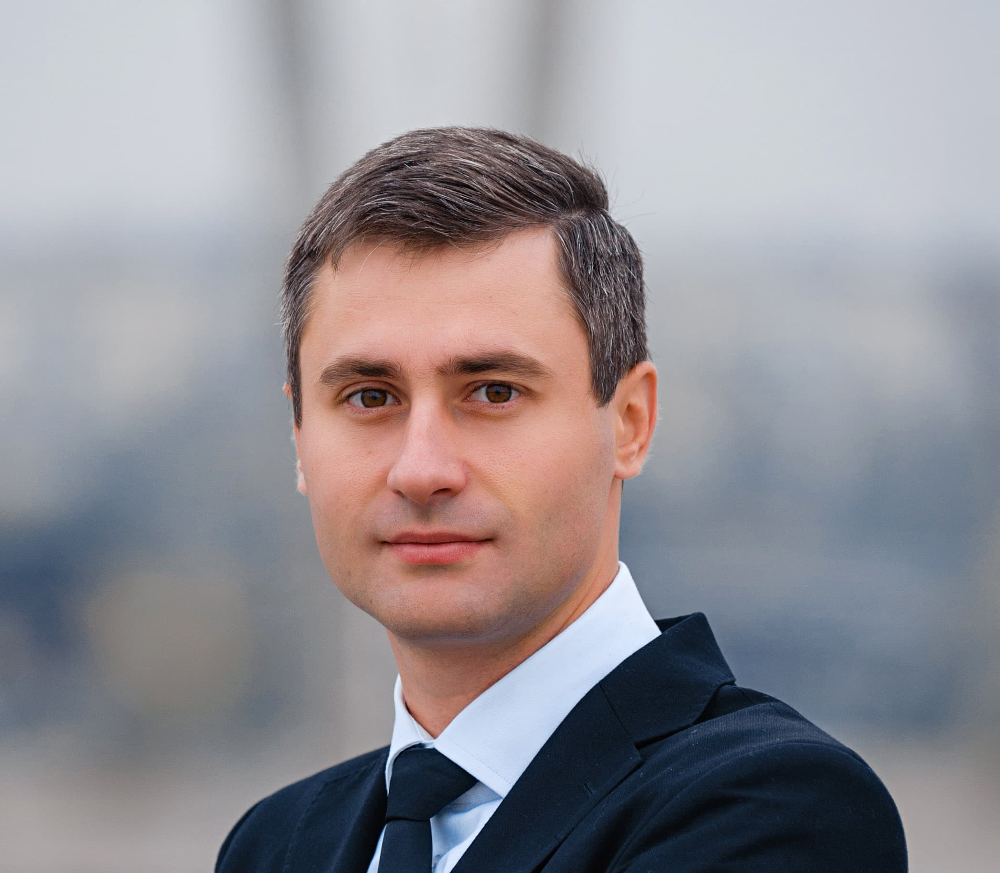

# **Artem Pryimenko**

## **Contacts:**

* Email: artem555_86@ukr.net
* Phone: +380663902299
* GitHub: [Artem55586](https://github.com/Artem55586/rsschool-cv.git)
* LinkedIn: [Artem Pryimenko](https://www.linkedin.com/in/артём-прийменко-553140257/)
* Discord: artem55586#8927

## **About Me:**

I've been in sales since 2009, but it's time to move forward.
I believe, that my ability to learn and to gain new skills will lead me through this path of becoming a proficient Frontend Developer.

* ### **My strengths:**
    * Integrity;
    * High communication skills;
    * Customer orientation;
    * Analytic skills;
    * Ability to communicate with different types of people;
    * Proactivity;
    * Perseverance;
    * Willingness and ability to learn;
    * Experience in sales;
    * Teamwork skills;
    * Desire and ability to work for the final result;
    * Active life position;
    * Ability to build long-term mutually beneficial relationships;
    * Stress tolerance;
    * Ability to work with large volumes of information;
    * Independent planning of working time;
    * Open FOP 3rd group.

## **Skills and Proficiency:**

In the process of acquiring new knowledge and skills.

To get acquainted with the profession, I went through a couple of short marathons from school:
[GoIT](https://goit.global/ua/)

Work examples:
* https://sunny-frangipane-723ebf.netlify.app
* https://stalwart-salamander-87a3b0.netlify.app
* https://ornate-frangipane-c0bfbe.netlify.app

## **Work experience:**

### **BaDM:**
12 years 5 months:

* #### **Deputy Director**
    August 2018 - October 2022 (4 years 3 months)
    Dnipro, Dnipropetrovsk region, Ukraine

    Deputy Director of LLC "BADM-B" / LLC "STM-Pharm" - the budgetary direction of the company LLC "BaDM"
Successful team management: 24 representatives, 10 assistants, 17 office employees, call center operators.
The company has been a leader in the budget segment of Ukraine all these years.

* #### **Territorial sales manager**
    June 2010 - July 2018 (8 years 2 months)
    Zaporozhye, Zaporozhye region, Ukraine

    * search, attracting customers;
    * making sales;
    * retention of existing customers; interaction
    * with medical institutions of the region,
    * building partnerships. expansion of the
    * market segment.

## **Education:**

* ### **Zaporozhye State Medical University**
    #### PhD, Pharmaceutical Chemistry and Pharmacognosy (October 2013)

* ### **Zaporozhye State Engineering Academy**
    #### Specialist, Management of organizations (2008 - 2009)

* ### **Zaporozhye State Medical University**
    #### Specialist, Pharmacy (2003 - 2008)

* ### **Dnepropetrovsk Institute of Physical Culture and Sports**
    #### Instructor, Aikido instructor (2005 - 2005)


## **Code Example:**

```javascript
const func = (num) => {
  if (num > 0) {
    return num - 1;
  }
  return num + 1;
};
```

## **Languages:**

* English - A1 - A2;
* Ukrainian - Native;
* Russian - Native.